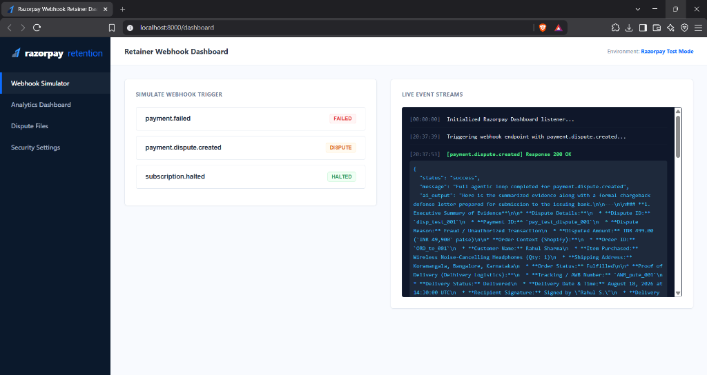

# Unified Revenue Retention Agent

A modern backend service designed to automate revenue retention by listening to payment gateway webhooks (e.g., Razorpay) for transaction failures or disputes, scrub sensitive customer data (PII), gather commerce and logistics context, and run autonomous execution actions (e.g. generating PDFs or sending recovery messages).



## Project Structure

The project has the following directory structure:

- **`core/`**: Core system guardrails and configuration (e.g., PII masking in `security.py`).
- **`models/`**: Data models and validation schemas (e.g., `RazorpayWebhook` schema in `schemas.py`).
- **`services/`**: Downstream business services and external client integrations:
  * `razorpay_client.py`: Mock context retrieval engine.
  * `llm_router.py`: LLM routing and prompt generation using Gemini Flash.
  * `action_executor.py`: Action dispatcher for PDF compiling and WhatsApp notifications.
- **`utils/`**: General helper functions and utilities (e.g., JSON event logger in `storage.py`).
- **`main.py`**: The FastAPI application entry point, containing the `/webhook` listener and Web Dashboard.
- **`.env`**: Local secret environment variables (excluded from Git).
- **`requirements.txt`**: Project dependencies.
- **`.gitignore`**: Pattern rules for files/folders to exclude from version control.

## Setup Instructions

1. **Activate the Virtual Environment:**
   * **Windows (PowerShell):** `.\.venv\Scripts\Activate.ps1`
   * **macOS/Linux:** `source .venv/bin/activate`

2. **Configure Environment Variables:**
   * Populate your credentials in the [`.env`](file:///C:/Users/aksha/.gemini/antigravity/scratch/Unified%20Revenue%20Retention%20Agent/.env) file:
     * `RAZORPAY_KEY_ID`
     * `RAZORPAY_KEY_SECRET`
     * `RAZORPAY_WEBHOOK_SECRET`
     * `GEMINI_API_KEY`

3. **Install wkhtmltopdf (Required for PDF generation):**
   * Download and install the binary package from **[wkhtmltopdf Downloads](https://wkhtmltopdf.org/downloads.html)**. On Windows, it should default to `C:\Program Files\wkhtmltopdf` (pre-configured in the code).

4. **Run the FastAPI server & Interactive Dashboard:**
   ```powershell
   python main.py
   ```
   * The webhook listener will spin up on `http://localhost:8000`.
   * An **Interactive Testing Dashboard** will automatically open in a new browser tab at `http://localhost:8000/dashboard` to let you test webhooks with one click.

5. **Expose Local Server with NGROK (for Razorpay Webhook testing):**
   Since Razorpay needs a public URL to send webhook events, use NGROK to expose your local port `8000`:
   ```powershell
   ngrok http 8000
   ```
   Copy the generated forwarding HTTPS URL (e.g., `https://xxxx.ngrok-free.app`) and configure it in your Razorpay Dashboard webhooks settings as the Webhook URL (pointing to `https://xxxx.ngrok-free.app/webhook`).

## Features and Guardrails

### 1. Security & PII Masking
All incoming webhook payloads are immediately scanned and cleaned by the PII masking logic in [`core/security.py`](file:///C:/Users/aksha/.gemini/antigravity/scratch/Unified%20Revenue%20Retention%20Agent/core/security.py). It recursively redacts string values matching:
* **Emails** -> `[REDACTED_EMAIL]`
* **Indian Phone Numbers** -> `[REDACTED_PHONE]` (e.g. `[6-9]\d{9}`, preventing timestamp collision)
* **Credit Card Numbers** -> `[REDACTED_CARD]`

### 2. Payload Validation & Local Logging
FastAPI automatically validates incoming webhooks using the Pydantic schema defined in [`models/schemas.py`](file:///C:/Users/aksha/.gemini/antigravity/scratch/Unified%20Revenue%20Retention%20Agent/models/schemas.py). Stored events are appended locally to `webhook_events.json` via [`utils/storage.py`](file:///C:/Users/aksha/.gemini/antigravity/scratch/Unified%20Revenue%20Retention%20Agent/utils/storage.py).

### 3. Context Retrieval & LLM Routing
Enriches webhooks with mock commerce (Shopify) and logistics (Delhivery) context inside [`services/razorpay_client.py`](file:///C:/Users/aksha/.gemini/antigravity/scratch/Unified%20Revenue%20Retention%20Agent/services/razorpay_client.py), then routes the prompt to Gemini (with fallback checking: `gemini-3.6-flash`, `gemini-2.0-flash`, `gemini-pro`) inside [`services/llm_router.py`](file:///C:/Users/aksha/.gemini/antigravity/scratch/Unified%20Revenue%20Retention%20Agent/services/llm_router.py).

### 4. Action Execution Engine
Dispatches real-world recovery actions inside [`services/action_executor.py`](file:///C:/Users/aksha/.gemini/antigravity/scratch/Unified%20Revenue%20Retention%20Agent/services/action_executor.py):
* **Dispute Defense Document:** Converts markdown LLM letters to beautiful HTML layouts using the `markdown` library, compiling them to PDF (`defense_letter_{payment_id}.pdf`) using `pdfkit`. If `wkhtmltopdf` is missing, it falls back to a UTF-8 text file.
* **Subscription Failure Recovery:** Simulates dispatching personalized WhatsApp messages containing custom UPI recovery links via Twilio sandbox.

## Handled Events

The `/webhook` endpoint currently listens for and processes:
1. `payment.dispute.created`
2. `payment.failed`
3. `subscription.halted`
